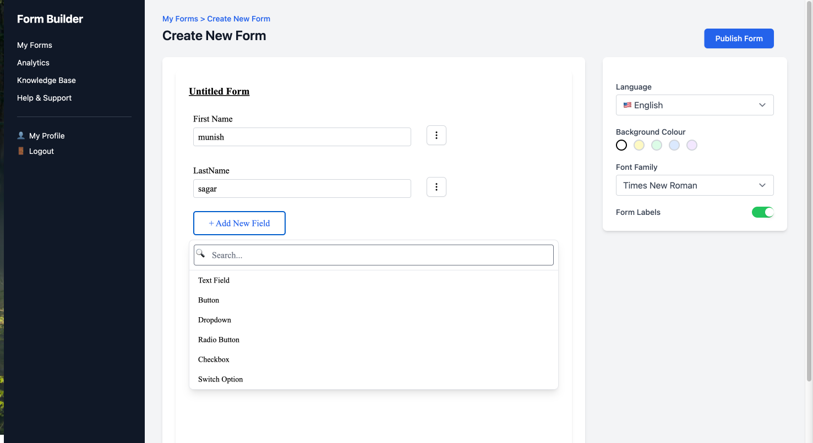
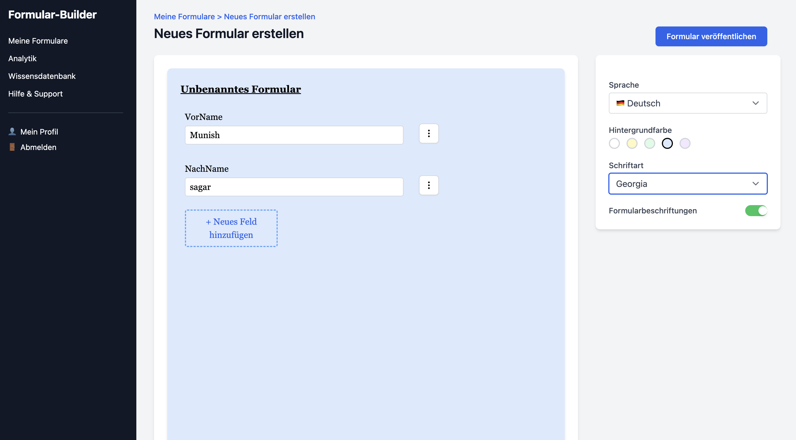
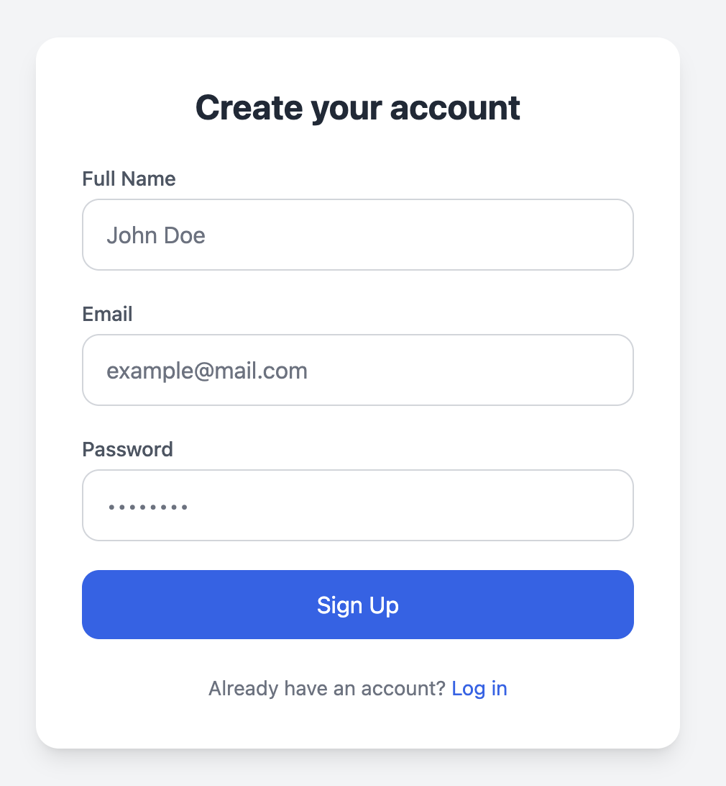
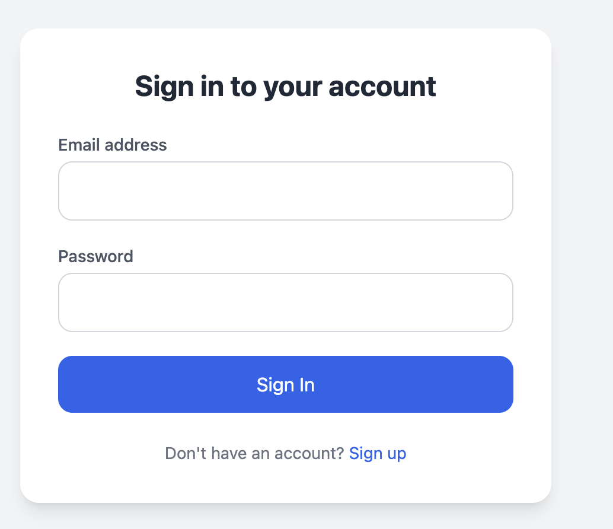
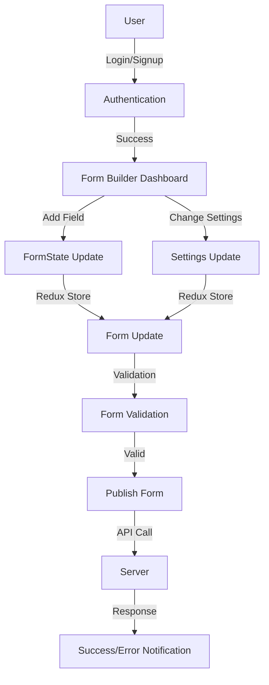
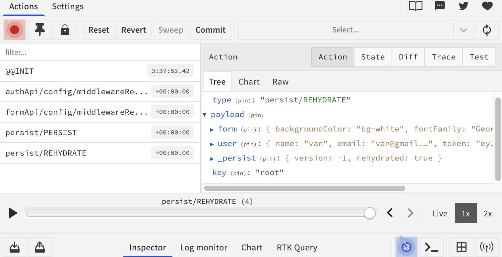
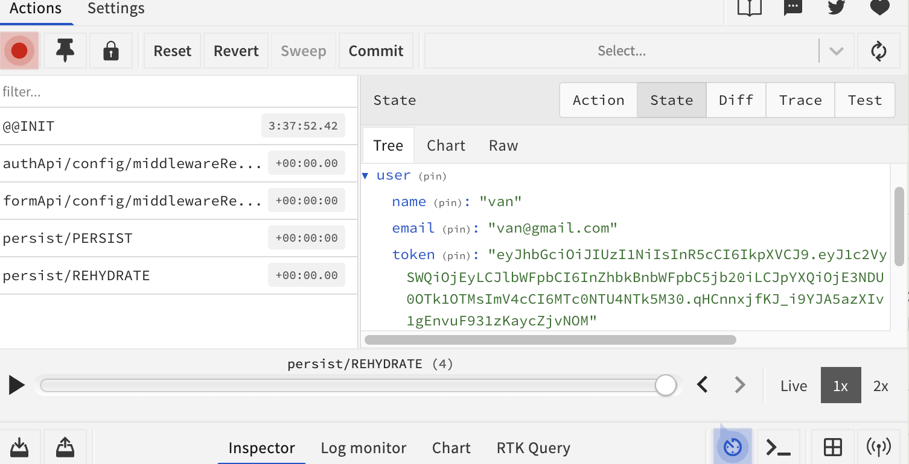

# Mini-Form Builder

The **Mini-Form Builder** is a dynamic web application that empowers users to create customizable forms through an intuitive interface. Built using React, Redux Toolkit, Tailwind CSS, and Express.js, the app internationalization, form validation, and secure user authentication.






## Features

- **Add Form Building** – Add text fields, dropdowns, checkboxes, radio buttons, switches, and buttons.
- **Styling Options** – Customize form background, fonts, and labels.
- **Form Labels Toggle** – Show/hide labels as needed.
- **Multi-language Support** – Currently supports English and German.
- **Form Validation** – Built-in validation using Yup.
- **User Authentication** – Secure login/signup with protected routes.
- **Form Publishing** – Save and publish created forms.

#

## Tech Stack

| Layer                    | Technologies                                                         |
| ------------------------ | -------------------------------------------------------------------- |
| **Frontend**             | React, TypeScript, Redux Toolkit, React Hook Form, Yup, Tailwind CSS |
| **Backend**              | Express.js                                                           |
| **State Management**     | Redux Toolkit, Redux Persist                                         |
| **Containerization**     | Docker                                                               |
| **Internationalization** | i18next                                                              |

---

## Application Architecture


## Project Structure

```
 src
├── 📁 components
│ ├── 📁 FormField
│ │ ├── 📄 ButtonField.tsx
│ │ ├── 📄 CheckBoxField.tsx
│ │ ├── 📄 DropdownField.tsx
│ │ ├── 📄 FormFieldWrapper.tsx
│ │ ├── 📄 RadioButtonField.tsx
│ │ ├── 📄 SwitchField.tsx
│ │ ├── 📄 TextField.tsx
│ │ └── 📄 index.ts
│ ├── 📁 Forms
│ │ ├── 📄 FormBuilder.tsx
│ │ ├── 📄 LoginForm.tsx
│ │ └── 📄 SignUpForm.tsx
│ └── 📁 UI
│ ├── 📄 Button.tsx
│ ├── 📄 SettingPannel.tsx
│ └── 📄 Switch.tsx
├── 📁 constants
│ └── 📄 formConstant.ts
├── 📁 layouts
│ └── 📄 FormLayout.tsx
├── 📁 routes
│ └── 📄 ProtectedRoutes.tsx
├── 📁 services
│ ├── 📄 authApi.ts
│ ├── 📄 baseApi.ts
│ └── 📄 publishFormApi.ts
├── 📁 stateManagement
│ ├── 📁 authuserState
│ │ └── 📄 userSlice.ts
│ ├── 📁 formState
│ │ └── 📄 formSlice.ts
│ └── 📄 store.ts
├── 📁 types
│ └── 📄 formTypes.ts
└── 📁 utils
 └── 📄 Validations.ts
```

## Application Flow



## Component Architecture

- **FormField Components**

  - 📄 `TextField.tsx`
  - 📄 `DropdownField.tsx`
  - 📄 `CheckBoxField.tsx`
  - 📄 `RadioButtonField.tsx`
  - 📄 `SwitchField.tsx`
  - 📄 `ButtonField.tsx`
  - 📄 `FormFieldWrapper.tsx`

- **Form Containers**

- 📄 `FormBuilder.tsx` – Main form builder

- **UI Components**

- 📄 `Button.tsx` – Reusable button UI
- 📄 `SettingPannel.tsx` – Customization and publishing settings
- 📄 `Switch.tsx` – Toggle UI component

- **Layouts**

- 📄 `FormLayout.tsx` – Layout wrapper for the builder page

- **Routing**

- 📄 `ProtectedRoutes.tsx` – Auth-guarded route logic

1.  **User Interaction**

- User adds fields, changes styling, or modifies settings in the builder.

2.  **Redux Action Dispatch**

- Actions like `addField`, `updateField`, `setBackground`, `toggleLabels` are dispatched.

- Below are visual examples of the state and action:




3.  **State Update via Reducers**

- `formSlice` updates the structure and appearance of the form.
- `userSlice` maintains user session and authentication info.

4.  **Component Re-render**

- Connected components detect store updates and re-render automatically with the latest form state.

5.  **Form Publish**

- On publishing, the complete form data is sent to the backend using RTK Query (`publishForm` endpoint).

6. **API Response**
   - Server returns success or error, and the user receives a notification accordingly.
     Redux State Management

- **Store Configuration**

- Located in `stateManagement/store.ts`
- Combines all slices and applies middleware (including RTK Query API middleware)

- **formSlice** (in `formState/formSlice.ts`)

  - Manages all form-related state:
  - Form field configurations (type, label, required, etc.)
  - Form layout and structure
  - Styling settings (background, fonts)
  - Label toggle
  - Reducers:
  - `addField`, `removeField`, `updateField`, `setFormStyle`, etc.

- **userSlice** (in `authuserState/userSlice.ts`)

- Manages authentication state:
- User login/logout
- Storing authenticated user data
- Access token handling
- Reducers:

- `setUser`, `clearUser`

- **Redux Persist**

- Persists form state to `localStorage`
- Allows users to resume editing even after refreshing the page

- **RTK Query Integration**
- API slices (`authApi`, `publishForm`) use RTK Query
- Handles data fetching, caching, and error states automatically
- Integrated directly into Redux store middleware

**Data Flow Overview**

1.  **User Interaction**

- The user interacts with the **Form Builder UI**
- Actions include:
  - Adding a form field
  - Changing styling (e.g., background, font)
  - Toggling form labels

2.  **Redux Action Dispatch**

- Redux actions are dispatched:
  - `addField(fieldData)`
  - `setBackground(color)`
  - `toggleLabels(boolean)`
- These actions describe what changed.

3.  **Reducer Updates**

- Corresponding reducers (in `formSlice` or `userSlice`) handle the actions
- They update the relevant part of the centralized Redux state

4.  **Component Reactivity**

- Connected React components subscribe to Redux state
- Any change triggers a **re-render** with updated form settings or fields

5.  **Form Submission**

- On publish, the complete form structure is retrieved from the Redux store
- RTK Query sends it to the backend API (`publishForm` endpoint)

6.  **Server Response**

- Server processes the form and sends back:
  - Success → Confirmation or redirect
  - Error → Message shown via toast/alert

## Authentication Flow

1.  **User Credential Input**

- User enters **email** and **password** in the `LoginForm` or `SignUpForm`.

2.  **Form Submission**

- Form data is submitted to the **authentication API** using **RTK Query** (`authApi`).

3.  **Token Handling**

- On successful login/signup:
  - A **JWT token** is returned from the server
  - The token is saved to `localStorage` for session persistence

4. **Redux State Update**

   - User information is stored in Redux using `userSlice`
     - e.g., `setUser({ id, name, email })`

5. **Route Protection**

- `ProtectedRoutes.tsx` uses Redux state to check if the user is authenticated
- Authenticated users gain access to protected pages (like the Form Builder dashboard)

6.  **Persistent Login**

- On app reload, `localStorage` is checked
- If token exists and is valid, user remains logged in
  🛠 **Installation**

> Prerequisites:
>
> - Node.js v14+
> - npm or yarn
> - Docker (optional)

```bash

# 2 Navigate to the project folder
cd frontend

# 3 Install dependencies
npm install --legacy-peer-deps
or
npm install

# 4️ Start the development server
npm start
```

---

### Future Enhancements

```markdown
**Planned Enhancements**

- Add more field types: date picker, file upload, time selector, etc.
- Implement drag-and-drop **reordering** of fields
- Provide **form templates** for faster creation
```

## Backend Overview

The backend is built with **Express.js**, **Prisma ORM**, and **PostgreSQL**, using **JWT** for authentication.

---

### 🔧 Key Technologies

- **Express.js** – API server
- **Prisma** – ORM for PostgreSQL
- **JWT** – Authentication tokens
- **bcrypt** – Password hashing

---

### Main Models (Prisma)

- **User**

  - `id`, `name`, `email`, `password`, `createdAt`, `updatedAt`
  - Relation: has many `forms`

- **Form**

  - `id`, `title`, `backgroundColor`, `showLabels`, `fontFamily`, `language`, `userId`
  - Relation: has many `fields`

- **FormField**
  - `type`, `name`, `label`, `placeholder`, `value`, `formId`

---

### Auth Flow

1. **POST `/register`**

   - Hashes password, stores user, returns JWT token

2. **POST `/login`**

   - Verifies credentials, returns JWT token

3. **POST `/logout`**

   - Optional, stateless route

4. **Auth Middleware**
   - Verifies JWT and attaches user to the request (`req.user`)

---

### Form API

- **POST `/form`** (Protected)
  - Creates a new form with multiple fields
  - Uses user ID from JWT token

---

### Backend Structure (Simplified)

```
backend/
├── controllers/       # auth & form logic
├── routes/            # auth routes
├── prisma/            # schema + client
├── server.ts          # server entry
└── .env               # JWT_SECRET, DATABASE_URL
```

---

### ▶ Run Backend Locally

```bash
cd backend
npm install
npm run dev

```
